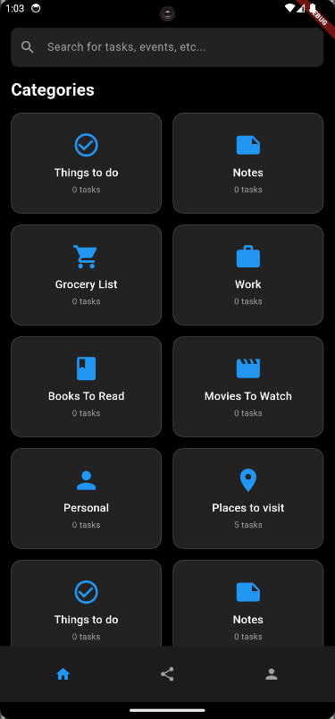
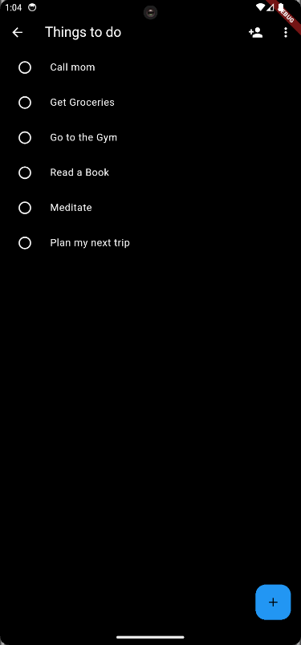
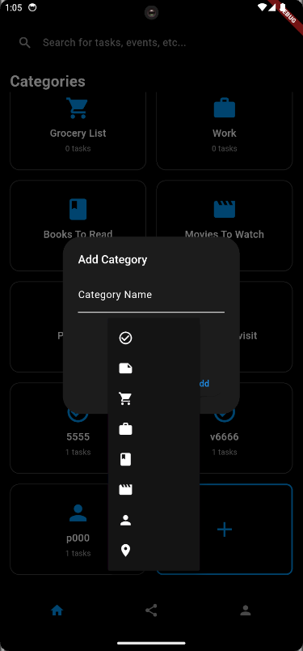
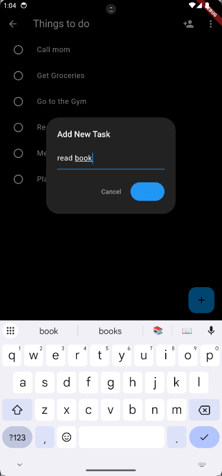
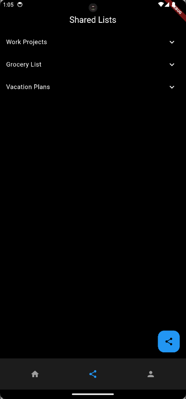

# 📱 ToDoz - Modern Flutter ToDo App

A beautiful, feature-rich ToDo application built with Flutter that helps you organize your tasks with an intuitive interface and powerful features.


## ✨ Features

### 🎯 **Task Management**

- **Smart Categories**: Pre-built categories for different types of tasks
- **Custom Categories**: Create your own categories with custom icons
- **Task Persistence**: All tasks are saved locally and persist between sessions
- **Task Counts**: Real-time display of task counts for each category
- **Swipe to Delete**: Easy task removal with swipe gestures

### 🎨 **Beautiful UI/UX**

- **Dark Theme**: Modern dark interface for comfortable viewing
- **Smooth Animations**: Staggered animations for category cards
- **Responsive Design**: Works perfectly on all screen sizes
- **Material Design**: Follows Google's Material Design guidelines
- **Intuitive Navigation**: Bottom navigation with easy access to all features

### 🔧 **Technical Features**

- **MVVM Architecture**: Clean separation of concerns
- **Provider State Management**: Efficient state management
- **Local Storage**: SharedPreferences for data persistence
- **Cross-Platform**: Runs on Android, iOS, Web, and Desktop
- **Modern Flutter**: Built with latest Flutter features

## 📱 Screenshots

### Dashboard


_Main dashboard with category grid and search functionality_

### Category View


_Category-specific task management with add/delete options_

### Add Category


_Easy category creation with icon selection_

### Add Task


_Simple task creation interface_

### Shared List


_Collaborative task sharing features_

### Profile


_User profile and app settings_

## 🚀 Getting Started

### Prerequisites

- Flutter SDK (3.16 or higher)
- Dart SDK
- Android Studio / VS Code
- Android SDK (for Android development)
- Xcode (for iOS development, macOS only)

### Installation

1. **Clone the repository**

   ```bash
   git clone https://github.com/yourusername/todo_app.git
   cd todo_app
   ```

2. **Install dependencies**

   ```bash
   flutter pub get
   ```

3. **Run the app**
   ```bash
   flutter run
   ```

### Building for Production

**Android APK:**

```bash
flutter build apk --release
```

**iOS:**

```bash
flutter build ios --release
```

**Web:**

```bash
flutter build web --release
```

## 🏗️ Project Structure

```
lib/
├── main.dart                 # App entry point
├── screens/                  # UI screens
│   ├── home_screen.dart     # Main dashboard
│   ├── task_list_screen.dart # Task management
│   ├── profile_screen.dart  # User profile
│   ├── share_screen.dart    # Sharing features
│   └── main_screen.dart     # Navigation wrapper
├── services/                 # Business logic
│   ├── auth_service.dart    # Authentication
│   └── task_service.dart    # Task operations
└── models/                   # Data models
    └── task_item.dart       # Task data structure
```

## 🎨 Customization

### Adding New Categories

The app comes with 8 pre-built categories, but you can easily add custom ones:

- Tap the "Add Category" button
- Choose a name and icon
- Your category appears instantly

### Modifying Default Categories

Edit the `_getDefaultCategories()` method in `home_screen.dart` to customize the default categories.

### Theme Customization

Modify the theme in `main.dart` to change colors, fonts, and overall appearance.

## 🔧 Dependencies

```yaml
dependencies:
  flutter:
    sdk: flutter
  provider: ^6.0.0 # State management
  shared_preferences: ^2.2.2 # Local storage
  flutter_staggered_animations: ^1.1.1 # Smooth animations
```

## 🤝 Contributing

Contributions are welcome! Please feel free to submit a Pull Request. For major changes, please open an issue first to discuss what you would like to change.

### How to Contribute

1. Fork the project
2. Create your feature branch (`git checkout -b feature/AmazingFeature`)
3. Commit your changes (`git commit -m 'Add some AmazingFeature'`)
4. Push to the branch (`git push origin feature/AmazingFeature`)
5. Open a Pull Request

## 📄 License

This project is licensed under the MIT License - see the [LICENSE](LICENSE) file for details.

## 🙏 Acknowledgments

- **Flutter Team** for the amazing framework
- **Material Design** for design inspiration
- **Provider Package** for state management
- **Flutter Community** for helpful packages

## 📞 Support

If you have any questions or need help:

- Open an issue on GitHub
- Check the Flutter documentation
- Join the Flutter community

## 🔮 Roadmap

- [ ] Cloud synchronization
- [ ] User authentication
- [ ] Task sharing and collaboration
- [ ] Advanced task filtering
- [ ] Task reminders and notifications
- [ ] Data export/import
- [ ] Multiple themes
- [ ] Offline support

---

⭐ **Star this repository if you find it helpful!**

Made with ❤️ using Flutter
